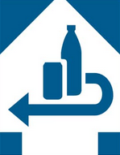

// Konzeption und generelle Überlegungen
// Der Kurs wird in drei Blöcke geteilt. **Jeder Block soll individuell verfügbar sein bzw. über einen separaten Link zu Beginn des neuen Blocks.**
// Die SuS bearbeiten die Aufgaben individuell in Ihrem Tempo.
// Die "Schnellen" tun sich am Ende einer Einheit zu einer Leistungsermittlung zusammen

Tutorial:
https://www.twillo.de/edu-sharing/components/render/818f2dd5-b67e-41e2-baa4-dacfe4d1edac?childobject_id=0d6fecfa-5105-4f82-a725-8e027e02d8ec

LIA-Help:
https://liascript.github.io/course/?https://raw.githubusercontent.com/liaScript/docs/master/README.md#1

# Mechatronische Systeme
Beispiel: Bearbeitungsstation
- Allgemeines zu Mechatronik
- Gesamt- und Teilsysteme
- Analyse und Beschreibung
- Darstellung als Blockschaltbild
- Energie-, Stoff- und Informationsfluss
- Anwendung: Pfandflaschenautomat - Aufgaben zur Bearbeitungsstation parallel anwenden und bewerten (Portfolio?) ACHTUNG! AUFWAND DER KORREKTUR ABSCHÄTZEN!

Stundenplanung
UE	Inhalte
1+2	
3+4	
5+6	Leistungsermittlung
7+8	Auswertung LE und Vertiefung/Übung, Auswertung "Sozialnote"

# Technische Berechnungen
Beispiel: Arbeitstag in einer Werkstatt/ Fabrik
- Was fallen für Aufgaben an? Aufstellflächen und Volumen, Einheitenvorsätze, Formeln, Kran (Hubarbeit, Flaschenzug), Gabelstapler, Beleuchtung--> Strompreise, Geschwindigkeiten von Förderbänder --> als Escape-Room gestalten (genially) und erreichtes Level bestimmt Note?
- Darstellung von Kräften --> als Reel, Podcast
- Gegenüberstellung "Arbeit" (Joule, Wattsekunde, Newtonmeter) und "Leistung"

Stundenplanung
UE	Inhalte
1+2	
3+4	
5+6	Leistungsermittlung
7+8	Auswertung und Vertiefung/Übung

# Ökologische und Ökonomische Aspekte
## Infos zu dieser Einheit

* **Themen:** Elektroschrott, Arbeitswelt 4.0

* **Stundenplanung:** Wir arbeiten 8 bis 10 Unterrichtseinheiten (UE) an diesem Themenkomplex. Die Leistungsermittlung erfolgt etwa in der sechsten UE. Anschließend werten wir diese aus und vertiefen unser Wissen weiter.

## Einwegpfand

**IDEEN:** Videos und Texte als Input, Erstellung Insta-Beitrag mit Canva --> VORAB Bewertungskriterien ausarbeiten!

**AUFGABE**
Finden Sie sich in Gruppen aus drei bis vier Personen zusammen. Bearbeiten Sie die folgenden Aufgaben: 

1. Stellen Sie die wichtigsten Unterschiede zwischen Einweg- und Mehrwegpfand gegenüber.
2. Benennen Sie die Bedeutung der folgenden Symbole:

    + 
    + 
    + 

3. Formulieren Sie Ziele, die mit der Einführung des Einwegpfandes verfolgt wurden. 
4. Diskutieren Sie im Zweierteam, ob diese Ziele erreicht wurden. Finden Sie Verbesserungsmöglichkeiten und begründen Sie diese.

## Elektroschrott

### Allgemeines

**Einführung**

Elektroschrott, oder kurz E-Schrott, sind elektrische und elektronische Geräte, die nicht mehr genutzt werden können oder deren Funktionsfähigkeit beeinträchtigt ist. Mit dem rasanten technologischen Fortschritt und der anhaltenden Nachfrage nach neuen Geräten ist das Aufkommen von Elektroschrott zu einem ernsthaften Umweltproblem geworden. Jährlich landen weltweit Millionen Tonnen alter Smartphones, Computer, Haushaltsgeräte und anderer elektronischer Produkte auf Deponien, was nicht nur wertvolle Rohstoffe wie Gold, Kupfer und seltene Erden ungenutzt lässt, sondern auch erhebliche Umweltschäden durch giftige Substanzen verursacht.

Die wiederholte Produktion und der Konsum von Elektronik tragen zur Erschöpfung bedeutender Ressourcen und zur Verschmutzung von Ökosystemen bei. Daher stellt sich die dringende Frage, wie Elektroschrott nachhaltig verwaltet und die darin enthaltenen Rohstoffe effizient recycelt werden können. Innovative Ansätze, wie Pfandsysteme und verbesserte Recyclingtechnologien, sind notwendig, um einen verantwortungsvollen Umgang mit Elektroschrott zu fördern und zukünftige Generationen vor den Folgen der wachsenden E-Abfälle zu schützen.

### Wie sieht es bei dir Zuhause im Schubfach oder in der Garage aus?

1. Steht dir ein PC/Laptop zu Hause zur Verfügung?

- [( )] Ja
- [( )] Nein
- [[?]] Es gibt kein Richtig oder falsch!
**************************************

In Deutschland besitzen laut verschiedenen Statistiken aus den letzten Jahren etwa **80-90% der Haushalte einen Laptop oder einen PC!** **Einbeldnug um ein GIF erweitern!?**

**************************************

2. Hast du Zuhause eine Konsole (Playstation, Switch, etc.)?

- [( )] Ja
- [( )] Nein
- [[?]] Es gibt kein Richtig oder falsch! Klicke auf das Häkchen.
**************************************

Schätzungen zufolge besitzen etwa **40% der Jugendlichen unter 18 Jahren** eine Spielekonsole. **Einbeldnug um ein GIF erweitern!?**

**************************************

3. Wie häufig kaufst du (oder jemand anderes in deiner Familie) dir ein neues Smartphone?

[[alle 3 Jahre]]
- [[?]] Es gibt kein Richtig oder falsch! Klicke auf das Häkchen.
**************************************

Laut verschiedenen Umfragen und Studien liegt die durchschnittliche Nutzungsdauer eines Smartphones häufig bei **etwa 2 bis 3 Jahren**, bevor die Benutzer ein neues Gerät erwerben. Einige Nutzer behalten ihre Smartphones auch länger, während andere häufiger wechseln, insbesondere wenn es um die neuesten Modelle geht. **Einbeldnug um ein GIF erweitern!?**

**************************************

### Pfandsystem für E-Schrott

**AUFGABE**

1. Lesen Sie den Artikel [**Goldgrube Elektroschrott – Macht ein Pfandsystem für Smartphones Sinn?**](https://www.mdr.de/wissen/pfand-auf-smartphone-und-elektroschrott-sinvoll-100.html). [qr-code](https://www.mdr.de/wissen/pfand-auf-smartphone-und-elektroschrott-sinvoll-100.html)
2. Beantworten Sie mithilfe des Artikels die folgenden Fragen:

    + Wie hoch ist der durchschnittliche Elektroschrott pro Kopf in Deutschland?
    + Was sind sogenannte „kritische Rohstoffe“?
    + Wo können kaputte oder ungenutzte Geräte entsorgt werden?
    + Wodurch wird das Recycling von Smartphones erschwert?
    + Warum lohnt es sich trotz des Aufwands Elektroschrott zu recyclen?
    + Welche Vorteile bietet ein Pfandsystem für Elektroschrott?

### Wer recycelt unseren E-Schrott?

Diese Videos sind eine Auswahl für weitereführende Informationen zum Thema Elektroschrott.

!?[Global E-Waste Report: Wohin mit dem Elektroschrott?](https://www.youtube.com/watch?v=P5_edASIcaE)

!?[Elektromülldeponie Agbogbloshie: Leben und arbeiten am verseuchtesten Ort der Welt](https://www.youtube.com/watch?v=07uMQ-J_T14&t=32s)

!?[Ghana: Was passiert mit Europas Schrott?](https://www.youtube.com/watch?v=R1t7ILyM2U4)

!?[Wie aus unserem Elektroschrott in Ghana neue Rohstoffe werden](https://www.youtube.com/watch?v=a0_kSs104SA)

### Mit E-Schrott zu richtig viel Schmott

**AUFGABE**
Hier sollen die SuS sich zusammenfinden und ihre Leute zur Abgabe von E-Schrott motivieren - irgendwie!

